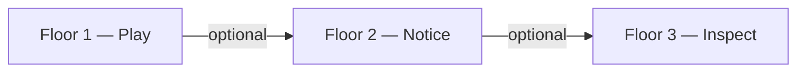

# The Resonant Singer

*A visual tuner for resonance — not pitch, not compatibility, not healing.*

---

A guitar tuner does not choose the note. It shows where the string is. You decide whether to bend, retune, or leave it.

This page does something analogous for **resonance inside a body**: where a sustained tone or a quiet hum might *land* in the chest, throat, skull, and ears — and where it might fall into a dead zone, or into a narrow notch where two coupled cavities cancel each other below silence.

That is a singer's vocabulary, borrowed from voice pedagogy: **placement**. Teachers say a note sits "in the mask," "in the chest," "behind the eyes." The words are operational because the sensation has no picture. The artifact is an attempt at the picture.

---

*[Open the instrument: `/index.html` on a local server, or the portable build in `dist/`]*

---

## Three floors (pick yours)

Floor 1 needs no docs. Floor 3 is optional and points to the research stack below.

**Floor one — play.** Drag the slider from 70 to 900 Hz. Click presets. Watch zones glow, couple, and sometimes dim below baseline at the ◊-marked frequencies on the left. Load a song and turn on the interference field. Switch view modes (Organs, Flow, Nerves, Solid, EM) and see the same physics through different visual weightings. No reading required. No belief required.

**Floor two — notice.** Read the panels. Try the protocols below. Ask whether what you feel lines up with what lights up — or doesn't. Disagreement is data.

**Floor three — inspect.** The repository is open source. The [architecture documentation](ARCHITECTURE.md) lists every stylization. Optional: [vibrational system](vibrational-system.md) (diagrams and reasoning). The [methodology registries](methodology/) track what we do not know on purpose. Offline tools generate synthetic sessions, build a relational graph over exploration patterns, and write weekly aggregate journals that are allowed to say *nothing happened.* That layer is research infrastructure, not mystique.

All three floors are legitimate. The project is deliberately **half instrument, half experiment.**

---

## What you are looking at (honestly)

The silhouette is not your body. It is a chain of **ten coupled resonators** — chest, heart region, trachea, larynx, pharynx, mouth, nasal cavities, skull, eyes, inner ear — each with a hand-tuned natural frequency and a bandwidth, wired together by an anatomical adjacency graph, not by guesswork from pixel distance.

When you move the drive frequency, the model asks: which harmonics of this tone fall near which cavity modes? How do excited zones lift their neighbors? Does the system cross a threshold where many zones fire at once — what the badge calls whole-system resonance?

Two further layers sit on top of that base physics:

1. **Breath** — a slow envelope modulating the internal source, because voice rides on exhale. Default is synthesized rhythm; you can tap spacebar or, if you prefer, let mic level shape it.

2. **Field** — when you add a song, external spectral peaks enter from a visualization point above the skull (legible geometry, not clinical acoustics; the UI says so). Internal hum rises from the larynx. The grid shows where those waves meet, construct, and cancel. That is **spatial** interference, distinct from the **spectral nulls** at the ◊ buttons, which are frequency-domain notches between paired zones. Both are real in the model; they are not the same phenomenon.

Nothing here measures whether a song "resonates with you" emotionally. The model does not know your biography. It computes a stylized acoustic cartoon informed by how singers describe placement — then invites you to compare cartoon to sensation.

**Want the full vibrational picture?** See the standalone companion: [**The body as a vibrational system (stylized)**](vibrational-system.md) — many clocks, source–filter, coupling, interference, diagrams, and a claim-vs-sensation checklist. Optional reading; the instrument works without it.

---

## A short protocol (optional)

You can ignore this entirely and still use the instrument fairly.

### One — quiet hum, eyes in

Find a quiet room. Headphones on, sound off, if that helps you listen inward.

Hum at the **quietest pitch you can sustain** — barely audible, jaw soft, lips relaxed. Do not perform. Notice where vibration seems to live: sternum, teeth, palate, skull. Thirty to sixty seconds.

Open the instrument. Move the slider slowly, or use **LISTEN · MIC** if you want the display to follow your pitch. *Mic changes the posture:* you are no longer only noticing; you are also being measured. That is optional. The slider alone preserves a purely first-person loop.

### Two — song as second source, body as medium

Choose a song you love. Comfortable volume. **Do not sing along.**

Keep the same silent hum from Step One. Let the track enter the model: load the file, play, raise **EXT BAL**, enable **FIELD**. Watch external and internal drivers overlap on the silhouette.

You are not asking whether the song is "your frequency." You are watching a **meeting** — two periodic sources superposed in a stylized volume (see [When two periodic sources meet](vibrational-system.md#when-two-periodic-sources-meet)) — and optionally asking whether that meeting resembles anything you feel in the chest or head.

Some people feel correspondence immediately. Some feel nothing. Some feel something the model does not show. All three outcomes are useful if you report them honestly.

### Three — sweep the spectrum (one minute)

Hit **SWEEP** and set **RATE** to 0.25×. Let the drive crawl. Watch peaks, nulls, and coupling states arrive in sequence. This is the fastest way to see that the body-in-the-model is a **system**, not ten independent lights — the same idea as [coupling](vibrational-system.md#coupling-why-one-glow-spreads-to-neighbors) and [two-source interference](vibrational-system.md#when-two-periodic-sources-meet) in motion.

---

## What this is not

Not clinical biomechanics. Not MRI. Not a claim that 432 Hz heals, that the vagus "wants" a tone, or that compatibility with an artist is encoded in Hertz.

Not a recommender. The badge may eventually show past-tense notes from aggregate exploration (*"sessions often paired chest and heart near this band"*), never *"try shifting down 8 Hz."* The user leads; the system reports.

Not a finished science. Zone frequencies carry `evidence` fields: phenomenological, pending citation, or drawn from acoustic literature ranges. Assumptions are registered with falsification conditions. When the model is wrong, the intended response is to **amend the description**, not defend the glow.

---

## Lineage (brief)

**Placement** in classical voice training — the felt address of a tone — is the central debt. Closed-mouth humming appears in many traditions (bee-breath in yoga, internal recitation in several contemplative lineages, warm-up hums in choral rooms). The artifact does not import a single tradition's metaphysics. It imports a **shared observation**: people can feel sound in specific interior locations, and that feeling can be attended to without making it loud.

**Vocal fry** — the low creaky register — sits at the edge of the slider range and excites the model differently because the source is broadband, not a clean fundamental. Fry is its own small essay; this instrument is enough to start.

What is new here is not the hum. It is the **legible coupled system**: nulls, coupling, interference, breath, optional mic, optional song — and beside it, a discipline that records ignorance on purpose.

---

## Safety (brief)

Benign for most people. Stop if jaw pain (TMJ), if inner-ear conditions make quiet hum uncomfortable, or if closed-eye listening while driving. If the practice tips from quiet into anxious, open your eyes, stand up, drink water. No virtue in pushing through.

---

## If you want to report what happened

Anonymous form: *[link when live]*

Prompts that matter equally:

- **What did you notice?**
- **What did not happen?**
- **I only watched it while cooking / coding / half-listening.**

The second and third keep this from becoming a confirmation gallery. Opt-in session export exists in the instrument for researchers; it sends scalars only, not audio. See the [README](../README.md).

Contact for collaboration or deeper technical material: *[contact]*

---

## How this artifact sits in the larger project

The browser page is the **front door**. Behind it:

- Architecture and glossary docs that stay code-true.
- A graph engine that asks whether two exploration patterns are structurally alike — or only alike because the chest always lights up (a neti-neti elimination test).
- Synthetic sessions that train classifiers on data whose physics we authored, so we can see whether machine learning recovers structure we planted.
- A journal-noticer that publishes null weeks with the same dignity as signal weeks.

That back room exists for people who build systems and care how systems fail when they pretend to know too much. It is not required for the practice above.

The artifact began as a single visual aid during a long evening of singing — time dilating, attention narrowing to where each pitch seemed to sit — and grew through iteration into an instrument with explicit unknowns. The methodology documents are the admission that stylization is not shameful; unmarked stylization is.

---

## Open source

MIT license. Repository: `resonant-singer`. Fork it, break the frequencies, add modes, argue with the adjacency graph. The physics module is readable in twenty minutes. Every design choice worth arguing about is written down.

Mic and song processing stay on your machine. Nothing uploads unless you export a session on purpose.

---

A tuner does not make the pitch. The player does.

Here, you may be both — the source and the ear that watches the source — made visible to each other for a little while.

Or it is colored light on a screen. That is also a valid use.

Use it however you want.
