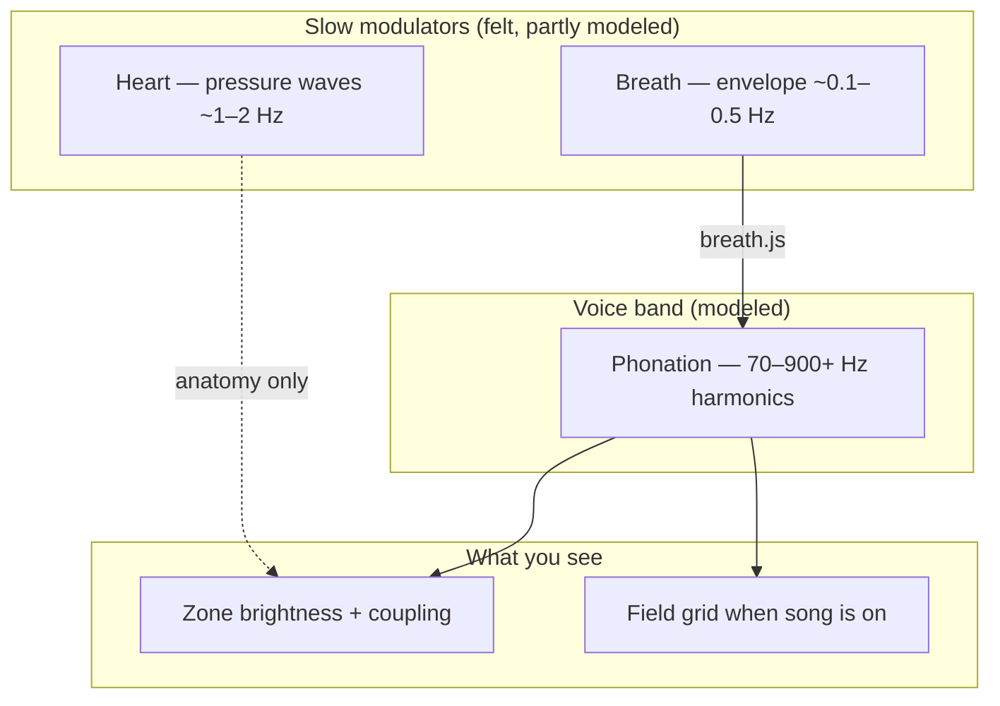
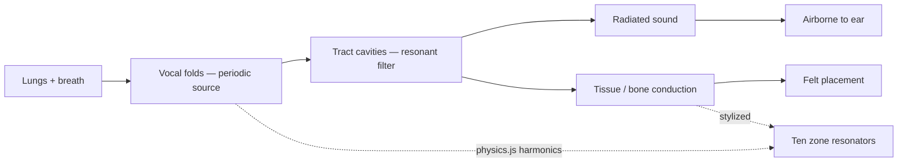
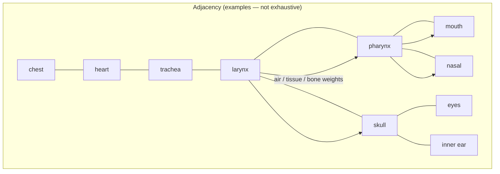
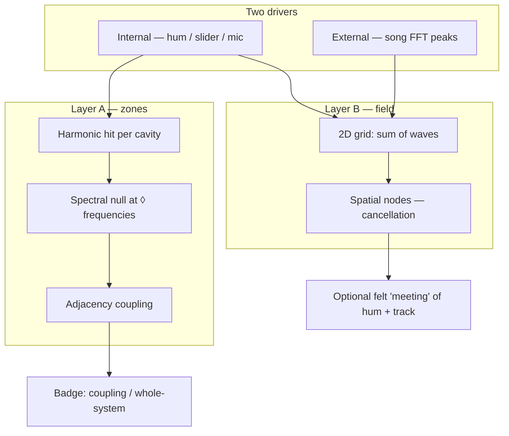
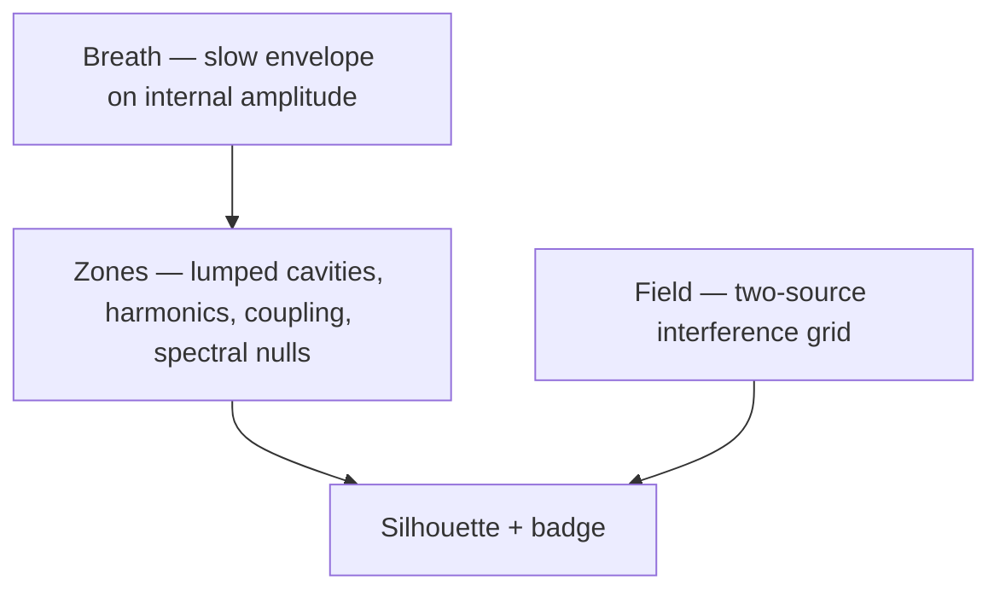

# The body as a vibrational system (stylized)

*A standalone companion to [The Resonant Singer](essay-draft.md). Rigorous reasoning about coupling, harmonics, and interference — without cosmology or clinical overclaim.*

**Also:** [Architecture](ARCHITECTURE.md) (code-true) · [Glossary](GLOSSARY.md) (three senses of “resonance”) · [Instrument](../index.html)

---

This page is for readers who want the **systematic picture** before or after using the instrument. It is not biomechanics on a screen. It is a disciplined way to think about why a single hum can feel like it lives in the chest, the teeth, or the skull — and why adding a song can change that feeling without you singing along.

Every section has two halves: what **physics and voice pedagogy** suggest, and what **the instrument actually computes**. When they diverge, the divergence is the point.

---

## Many clocks at once

A living body is never silent in the mechanical sense. Several rhythms run in parallel:

| Rhythm | Typical scale | Role in singing / humming |
|--------|----------------|---------------------------|
| **Cardiac** | ~1–1.6 Hz (60–100 bpm) | Pressure pulses through blood and soft tissue; not your phonation pitch, but a slow carrier you may feel as pulse under a sustained hum |
| **Respiratory** | ~0.1–0.5 Hz (breath rate) | Envelope: voice and hum **ride on exhale**; amplitude rises and falls with the breath cycle |
| **Phonation** | ~70–900+ Hz (instrument slider) | The pitch you choose or sustain — harmonics of the vocal-fold buzz |
| **Neural oscillation** | Hz to tens of Hz (brain rhythms) | Real in EEG; **not** what the canvas plots. Mentioned only so we do not confuse “brain frequency” with “note frequency” |

The instrument does not simulate the heart or EEG. It **modulates** the internal source with a breath envelope and marks cardiac anatomy for orientation. Your **felt** hum may still mingle cardiac pulse with phonation — that is phenomenology the model does not resolve.

---

## From buzz to placement: source and filter

Classical voice acoustics separates two jobs:

1. **Source** — vocal folds chop airflow into a rich periodic **buzz** (many harmonics at integer multiples of the fundamental).
2. **Filter** — the tract (pharynx, mouth, nose) preferentially passes certain bands — **formants** — so energy piles up where cavities reinforce.

**Placement**, in pedagogy, is the felt consequence of that filter chain: where the buzz seems to **address** the body after it leaves the folds and travels through bone, cartilage, air, and fluid.

The model’s larynx driver stands in for the source; each zone’s natural frequency and bandwidth stand in for crude lumped filters; harmonics are scanned explicitly so a single slider frequency can excite chest on the second harmonic and skull on the fifth, for example.

**Honest limit:** real conduction paths are three-dimensional and person-specific. The silhouette is a **1D cartoon** with an adjacency graph, not a finite-element head.

---

## Coupling: why one glow spreads to neighbors

In acoustics, **sympathetic resonance** is familiar: strike one tuning fork, bring a matched fork near it, and the second begins to move without being struck. Energy transfers because the systems share a compatible mode and a physical pathway.

The instrument’s zones are wired the same way in software: not by pixel distance on the canvas, but by an **anatomical adjacency graph** — air along the tract, tissue between throat and chest, bone toward skull and inner ear. When one zone’s response crosses a threshold, neighbors receive a fraction of that excitation. That is how a drive at the larynx can lift pharynx, mouth, and skull in sequence, or how the badge can read **whole-system resonance** when many zones fire together.

**What the model does:** `applyCoupling` after per-zone harmonic response.  
**What you might feel:** a single hum “opening” along a path — or nothing like the path drawn. Both are valid reports.

---

## When two periodic sources meet

[Protocol Step Two](essay-draft.md#two--song-as-second-source-body-as-medium) adds a **second source**: the song’s spectral peaks (external) while you keep a **silent hum** (internal). In wave terms you have superposition: two periodic contributions in the same stylized volume.

Three outcomes matter for the instrument:

| Phenomenon | Physics (plain) | In the model |
|------------|-----------------|--------------|
| **Constructive interference** | Peaks align; amplitude grows | Bright regions on the **field** grid; zones may gain extra lift from strong field samples |
| **Destructive interference** | Peaks oppose; amplitude cancels | Dark bands on the field — **spatial nodes** |
| **Beats** | Two close frequencies fall in and out of phase | Slow pulsing you may hear in the room; the field can show shifting patterns; zone dynamics low-pass but do not run a full phase ODE per cavity |

These are **not** the same as the ◊ **spectral nulls** on the left rail. Nulls are narrow notches at √(f₁·f₂) between **adjacent zone pairs** in frequency space — a design choice for “dead” bands between coupled cavities. The field is **spatial**: where external and internal waves meet on the grid. Both can be active; conflating them loses information.

**What we do not claim:** that destructive interference on the canvas is “blocked energy” in your psyche, or that alignment with a track is spiritual resonance. It is geometry in a stylized volume — a picture you can compare to sensation.

---

## Impedance and friction (carefully)

It is tempting to map **psychological resistance** — clinging to memory, bracing for the future — onto **acoustic impedance**, where mismatched loads stop energy from flowing cleanly. The metaphor is vivid: out-of-phase mind, beat frequencies of anxiety.

This project **does not** compute that mapping. Emotional life is not in the repository. The useful borrow is narrower: when two acoustic modes are **slightly** detuned, you get beats instead of smooth reinforcement; when a cavity pair is tuned to a null, energy in that band is suppressed in the model. Use the metaphor if it helps you notice; do not treat the canvas as a diagnostic of inner blockage.

---

## Claim vs sensation (checklist)

| Statement | Model | Your body |
|-----------|-------|-----------|
| “This frequency lights the chest.” | Harmonic of drive near chest mode | May match, may not |
| “The song and hum cancel here.” | Field node or low sample | May feel dull or may feel unchanged |
| “Whole-system resonance.” | Many zones above threshold after coupling | May feel unified or may be visual only |
| “This song is my frequency.” | **Not computed** | Meaning, memory, taste — [out of scope](GLOSSARY.md#three-senses-of-resonance) |

Stylization is not fraud if it is labeled. The practice is to **compare** cartoon to feeling and record both agreement and mismatch.

---

## Three composed layers (summary)

The browser stacks orthogonal abstractions — they multiply, they do not overwrite:

Details: [ARCHITECTURE.md §2](ARCHITECTURE.md#2-composed-physics-three-layers).

---

*Back to [The Resonant Singer](essay-draft.md) · [Documentation index](README.md)*
